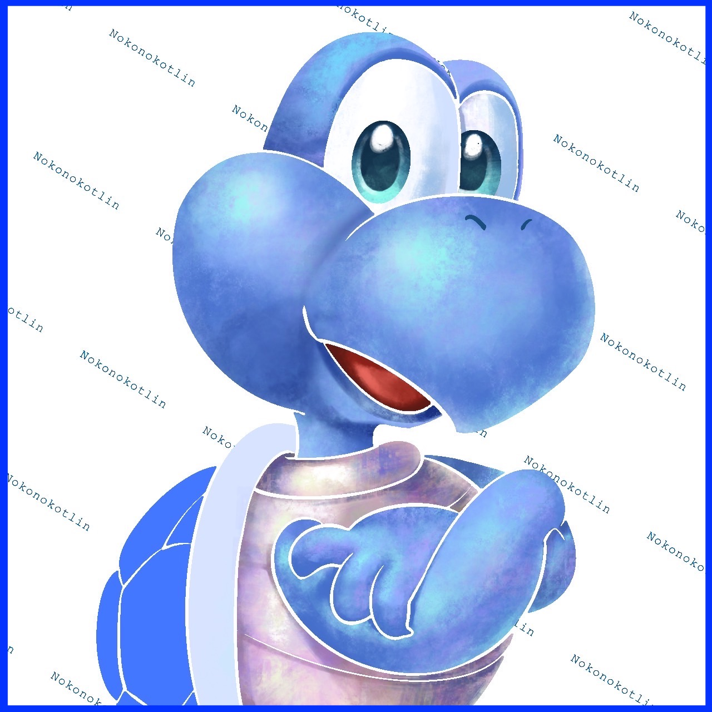

# NokonoKotlin Library

<p align="left">
	 
	
</p>

<p align="left">
	
</p>


<h3 align="left">My WebSite:</h3>
<p align="left">
	<a href="https://nokonokotlin.github.io/Home/index.html" target="blank"></a>  
	<a href="https://nokonokotlin.github.io/Home/database/algorithm_database/index.html" target="blank"></a>
</p>


<h3 align="left">Connect with me:</h3>
<p align="left">
	<a href="https://twitter.com/nokonokotlin" target="blank"></a>
	<a href="https://codeforces.com/profile/nokonokotlin" target="blank"></a>
</p>


<p align="left">  </p>

<p align="left"> <a href="https://twitter.com/nokonokotlin" target="blank"></a> </p>


<h3 align="left">Languages and Tools:</h3>
<p align="left"> 
	<a href="https://www.w3schools.com/cpp/" target="_blank" rel="noreferrer">  </a> <a href="https://flask.palletsprojects.com/" target="_blank" rel="noreferrer">  </a> 
	<a href="https://www.java.com" target="_blank" rel="noreferrer">  </a> <a href="https://www.mysql.com/" target="_blank" rel="noreferrer">  </a> 
	<a href="https://www.python.org" target="_blank" rel="noreferrer">  </a> 
</p>


# ライセンス的なもの
このリポジトリにあるコードに関して、以下は許します。  
- 他人に共有しない場所で個人使用する。  
- このコードを使い、競技プログラミングの提出コードとして提出する(ただし、その提出を他者に共有するのは禁止)。  

以上 2 つ以外の用途は認めません。


## algorithm/LinkCutTree  
```
辺を自由に切ったり張ったりした上で、Tree上のpathに関する情報を管理できる。  
LCAや、根の張り替えにも対応。構築以外の各操作はO(logN)  
任意のパス上の頂点の持つデータのマージ結果を計算できる。  
辺にデータを持たせたい時は頂点と頂点の間に余分に頂点を作り、余分な頂点にデータを持たせてそれを辺のデータとして扱う。
```
  
    
## algorithm/ExtendedArray
```
数列タイプの平衡二分木とほぼ同じ操作が可能。  
また、index の型が自由であり、index 値の範囲が計算量に影響しない。  
```

## algorithm/Kd Segment Tree
```
K 次元のグリッド上での{矩形取得,点更新} または {矩形更新、点取得} が可能。
```

## algorithm/Kd Tree
```
K 次元の空間内の点集合に対する操作が可能
```


## algorithm/mod library
```
定数 p に対して、剰余環 Z/pZ 内での数学的処理を行う。
    modint : Z/pZ の整数型
    FFT    : 高速フーリエ変換 (+畳み込み)
```


## algorithm/Rerooting
```
全方位木 DP
    木 T の全ての頂点に対して、その頂点が根である場合の評価値を計算する。
```


## algorithm/Suffix Tree
```
列に対して接尾辞木を構築する。
Ukkonen's Algorithm を採用(オンライン構築可能)。  
部分文字列系の問題に対する解決策として tier 1 
```


## 開発


## ChatApp 
	初めて作った動くアプリケーション  
	コードに関してメモがあるが、あまり覚えてはいない。  
	flaskで作った。  
	チャットメッセージをデータベースに入れたり出したりして表示、受信する。   
	一番大事な特徴は、位置情報を使っており、自分の近くにいる人とのみ会話可能(厳密には少し違うけど)   

	